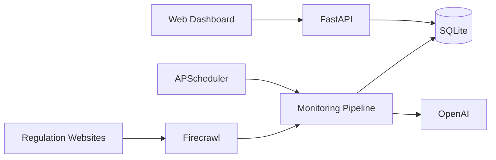

# EU AI Regulation Monitor

**Smart Monitoring & Compliance Analysis Platform**

An internal platform for monitoring European regulations relevant to Smart TV products. It automatically detects website updates, performs AI-assisted impact analysis, tracks historical changes, and provides compliance insights through an interactive web dashboard.

**Current version:** v1.1.5 Stable (see [`VERSION`](VERSION))

---

## Features

- **Multi-source monitoring** — configurable daily/weekly schedules per regulation source
- **Multi-page website crawling** — homepage plus discovered child pages with per-page change detection
- **AI-assisted impact analysis** — OpenAI-powered risk and module impact assessment
- **Snapshot management** — content hashing and markdown storage under `data/raw/`
- **Change detection** — diff engine with unified change views
- **Run history** — persistent run records in SQLite with page-level results
- **Run Details** — drill-down page for each manual or linked historical run
- **Dashboard** — overview, recent activity, and risk cards
- **Manual monitoring** — Run button per monitor in Monitor Management
- **Scheduled monitoring** — APScheduler daily/weekly jobs via CLI or Docker scheduler service
- **Report generation** — weekly AI executive summaries with optional email delivery
- **REST API** — monitors, runs, changes, knowledge, reports, search
- **SQLite persistence** — unified `data/storage.db` for monitors, snapshots, diffs, knowledge, and runs
- **Category management** — extensible monitor categories with normalization and suggestions
- **Docker deployment** — dashboard and scheduler containers

---

## Architecture



See [docs/Architecture.md](docs/Architecture.md) for the full v1.1.5 diagram and component reference.

---

## Tech stack

| Layer | Technology |
|-------|------------|
| Backend | FastAPI, Uvicorn |
| Frontend | Jinja2, Bootstrap 5 |
| Database | SQLite |
| Crawler | Firecrawl |
| AI | OpenAI Responses API |
| Scheduler | APScheduler |
| Runtime | Python 3.11 |

---

## Quick start

### Local development

```bash
git clone <repository-url>
cd AI_Regulation_Project

python -m venv .venv
.venv\Scripts\activate        # Windows
# source .venv/bin/activate   # Linux/macOS

pip install -r requirements.txt
cp .env.example .env
# Edit .env with OPENAI_API_KEY and FIRECRAWL_API_KEY

uvicorn app.web.app:app --reload --host 0.0.0.0 --port 8080
```

Open http://localhost:8080

### Docker

```bash
cp .env.example .env
docker compose build
docker compose up -d
```

See [docs/Deployment.md](docs/Deployment.md).

---

## Configuration

| Variable | Required | Purpose |
|----------|----------|---------|
| `OPENAI_API_KEY` | Yes | Regulation analysis and reports |
| `FIRECRAWL_API_KEY` | Yes | Web crawling |
| `SMTP_PASSWORD` | No | Email notifications |

Monitor seed file: `config/monitors.json` (imports new monitors into SQLite on first run)  
Runtime monitor source of truth: `data/storage.db`

Full reference: [docs/configuration.md](docs/configuration.md)

---

## CLI

```bash
python main.py run-once          # Run all enabled monitors once
python main.py scheduler         # Start scheduled jobs
python main.py status            # Monitor and run history status
python main.py generate-report   # Generate weekly report
```

---

## Testing

```bash
python -m pytest
```

**470 tests** passing at v1.1.5 Stable release.

---

## Documentation

| Document | Description |
|----------|-------------|
| [docs/ReleaseNotes.md](docs/ReleaseNotes.md) | v1.1.5 Stable release summary |
| [CHANGELOG.md](CHANGELOG.md) | Version history |
| [docs/Architecture.md](docs/Architecture.md) | System design and diagrams |
| [docs/API.md](docs/API.md) | REST API reference |
| [docs/Database.md](docs/Database.md) | SQLite schema |
| [docs/DeveloperGuide.md](docs/DeveloperGuide.md) | Local development |
| [docs/Deployment.md](docs/Deployment.md) | Docker deployment |
| [docs/Roadmap.md](docs/Roadmap.md) | v1.2.0 planned features |
| [docs/user-guide.md](docs/user-guide.md) | Day-to-day operator guide |
| [docs/configuration.md](docs/configuration.md) | Environment variables |

---

## Project structure

```
app/
  monitors/       Repository, run store, execution, categories
  web/            FastAPI dashboard and templates
  pipeline.py     Monitoring orchestration
  storage/        Snapshots, diffs, knowledge
  scheduler.py    Scheduled jobs
config/           Seed configuration
data/             SQLite DB, raw snapshots, reports
docs/             Architecture, API, deployment guides
tests/            Pytest suite
main.py           CLI entry point
```

---

## v1.1.5 Stable release summary

This release delivers:

1. **Multi-page monitoring** with per-page change tracking
2. **SQLiteMonitorRepository** as the single monitor source of truth
3. **Manual runs** from Monitor Management with Run Details pages
4. **Category management** — custom categories with datalist suggestions
5. **Monitor UI polish** — responsive table, dropdown actions, status badges

Details: [docs/ReleaseNotes.md](docs/ReleaseNotes.md)

---

## License

Internal use only.
