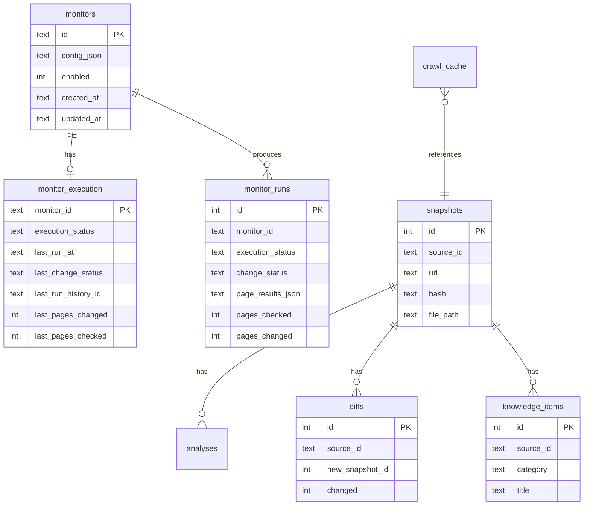

# Database Reference — v1.1.5 Stable

The platform uses a single SQLite database file:

```
data/storage.db
```

Additional file-based persistence:

| Path | Purpose |
|------|---------|
| `data/raw/` | Markdown snapshot files |
| `data/metadata/snapshots.json` | Snapshot metadata index |
| `data/run_history.json` | Batch run summary log |
| `data/reports/` | Generated weekly report JSON |

---

## Schema overview



---

## Monitor tables (v1.1.4+)

### `monitors`

Canonical monitor configuration. Full monitor dict is stored as JSON in `config_json`.

| Column | Type | Description |
|--------|------|-------------|
| `id` | TEXT PK | Monitor identifier |
| `config_json` | TEXT | Serialized monitor config (name, url, keywords, category, crawl_mode, etc.) |
| `enabled` | INTEGER | 1 = enabled, 0 = disabled |
| `created_at` | TEXT | ISO timestamp |
| `updated_at` | TEXT | ISO timestamp |

**Source of truth:** runtime CRUD via UI/API writes here. `config/monitors.json` seeds new IDs only.

### `monitor_execution`

Latest execution state per monitor (one row per monitor).

| Column | Type | Description |
|--------|------|-------------|
| `monitor_id` | TEXT PK | FK to `monitors.id` |
| `execution_status` | TEXT | `idle`, `running`, `success`, `failed` |
| `last_run_at` | TEXT | ISO timestamp of last finished run |
| `last_status` | TEXT | Legacy alias; mirrors change status |
| `last_change_status` | TEXT | `changed`, `unchanged`, `baseline`, `failed`, `running` |
| `last_pages_changed` | INTEGER | Pages changed in last run |
| `last_pages_checked` | INTEGER | Pages checked in last run |
| `last_snapshot_id` | INTEGER | Primary snapshot from last run |
| `last_diff_id` | INTEGER | Primary diff from last run |
| `last_error` | TEXT | Error message if failed |
| `last_run_history_id` | TEXT | FK to `monitor_runs.id` |
| `updated_at` | TEXT | ISO timestamp |

`last_change_status` is added via safe `ALTER TABLE` migration on startup if missing.

---

## Run history table (v1.1.5)

### `monitor_runs`

Persistent run records for Run Details. Auto-increment `id` is the `run_history_id`.

| Column | Type | Description |
|--------|------|-------------|
| `id` | INTEGER PK | Run history ID |
| `monitor_id` | TEXT | Monitor identifier |
| `monitor_name` | TEXT | Display name at run time |
| `triggered_by` | TEXT | `manual_ui`, `cli`, `scheduler` |
| `execution_status` | TEXT | `success` or `failed` |
| `change_status` | TEXT | `changed`, `unchanged`, `baseline`, `failed` |
| `started_at` | TEXT | ISO timestamp |
| `finished_at` | TEXT | ISO timestamp |
| `duration_ms` | INTEGER | Run duration |
| `pages_checked` | INTEGER | Total pages crawled |
| `pages_changed` | INTEGER | Pages with changes |
| `homepage_changed` | INTEGER | 0/1 boolean |
| `child_pages_changed` | INTEGER | Changed child page count |
| `pages_added` | INTEGER | New pages discovered |
| `pages_removed` | INTEGER | Removed pages |
| `pages_failed` | INTEGER | Failed page fetches |
| `snapshot_id` | INTEGER | Primary snapshot |
| `diff_id` | INTEGER | Primary diff |
| `error` | TEXT | Top-level error message |
| `page_results_json` | TEXT | JSON array of per-page results |
| `legacy` | INTEGER | 1 = no page-level details |
| `created_at` | TEXT | ISO timestamp |

**Page result object** (inside `page_results_json`):

```json
{
  "url": "https://example.com/page",
  "page_title": "Page Title",
  "page_type": "homepage|child",
  "status": "changed|unchanged|added|removed|failed|baseline",
  "snapshot_id": 10,
  "previous_snapshot_id": 9,
  "diff_id": 5,
  "content_hash": "...",
  "error": null
}
```

Historical runs remain stable after subsequent runs because each run stores its own JSON snapshot.

---

## Core pipeline tables

### `snapshots`

Crawled page content references.

| Column | Type | Description |
|--------|------|-------------|
| `id` | INTEGER PK | Snapshot ID |
| `source_id` | TEXT | Monitor ID |
| `url` | TEXT | Normalized URL |
| `title` | TEXT | Page title |
| `timestamp` | TEXT | Capture time |
| `file_path` | TEXT | Path under `data/raw/` |
| `hash` | TEXT | SHA-256 content hash |
| `created_at` | TEXT | ISO timestamp |

### `diffs`

Content differences between snapshots.

| Column | Type | Description |
|--------|------|-------------|
| `id` | INTEGER PK | Diff ID |
| `source_id` | TEXT | Monitor ID |
| `old_snapshot_id` | INTEGER | Previous snapshot |
| `new_snapshot_id` | INTEGER | Current snapshot |
| `changed` | INTEGER | 0/1 |
| `added_content_json` | TEXT | Added sections |
| `removed_content_json` | TEXT | Removed sections |
| `diff_text` | TEXT | Unified diff text |
| `created_at` | TEXT | ISO timestamp |

### `analyses`

AI impact analysis linked to snapshots.

### `crawl_cache`

URL-level cache to skip unchanged re-crawls when appropriate.

### `knowledge_items`

Structured regulation entries extracted from analyses.

---

## Migrations

v1.1.5 uses **additive, idempotent migrations**:

- `CREATE TABLE IF NOT EXISTS` for new tables
- `ALTER TABLE ... ADD COLUMN` for `monitor_execution.last_change_status`
- No automatic rewrite of existing category or monitor values

Inspect schema manually:

```bash
sqlite3 data/storage.db ".schema monitors"
sqlite3 data/storage.db ".schema monitor_runs"
sqlite3 data/storage.db "PRAGMA table_info(monitor_execution);"
```

---

## Backup recommendations

Back up before upgrades:

```bash
cp data/storage.db data/storage.db.bak
tar -czf data-backup.tar.gz data/
```

Docker volumes mount `./data` — back up the host directory.

---

## Related documents

- [Architecture.md](Architecture.md)
- [API.md](API.md)
- [Deployment.md](Deployment.md)
