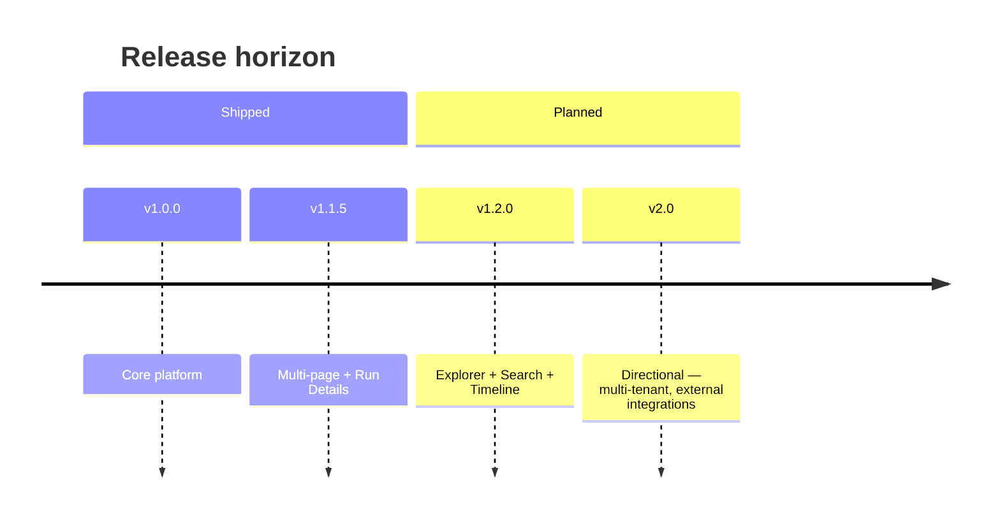

# Product Roadmap

**Current stable release:** v1.1.5 (July 2026)  
**Next planned release:** v1.2.0

---

## v1.1.5 Stable — Shipped

Focus: **operate and observe** — reliable monitor management, multi-page detection, and run visibility.

| Area | Delivered |
|------|-----------|
| Multi-page monitoring | Per-page crawl, diff, and change summary |
| SQLite monitor repository | Canonical monitor store in `data/storage.db` |
| Manual monitoring | UI Run button + execution API |
| Run Details | Persistent runs with page-level results |
| Monitor UI | Compact table, Run/More actions, status badges |
| Category management | Extensible categories with normalization |
| Documentation | Full v1.1.5 doc refresh |

---

## v1.2.0 — Planned

Theme: **explore and understand** — deeper site structure visibility and enhanced knowledge discovery.

### Planned features

| Feature | Description |
|---------|-------------|
| **Website Explorer** | Browse discovered pages for a monitor source |
| **Page Tree** | Hierarchical view of homepage → child pages |
| **Website Health** | Crawl success rates, failures, and staleness indicators |
| **Knowledge Base Search** | Enhanced search UX across regulation items |
| **AI Summary** | On-demand summaries for changes and knowledge entries |
| **Timeline View** | Chronological view of changes and runs |

### Not in v1.2.0 scope (unless reprioritized)

- Multi-tenant authentication
- External webhook integrations
- Non-SQLite database backends
- Public SaaS deployment model

---

## v1.0 baseline (reference)

v1.0.0 delivered the initial internal platform: dashboard, scheduler, crawler, diff engine, AI analysis, knowledge base, and weekly reports. See [release_notes_v1.0.md](release_notes_v1.0.md).

---

## How priorities are set

1. Internal Smart TV / connected-device compliance team feedback
2. Operational reliability and observability (v1.1.x theme)
3. Discovery and analysis depth (v1.2.x theme)
4. Platform scale and collaboration (v2.0 horizon)

---

## Contributing to the roadmap

Log enhancement requests with:

- Monitor ID or source affected
- Current workaround
- Expected outcome for compliance workflows

---

## Related documents

- [ReleaseNotes.md](ReleaseNotes.md) — v1.1.5 release summary
- [CHANGELOG.md](../CHANGELOG.md) — version history
- [Architecture.md](Architecture.md) — current system design
