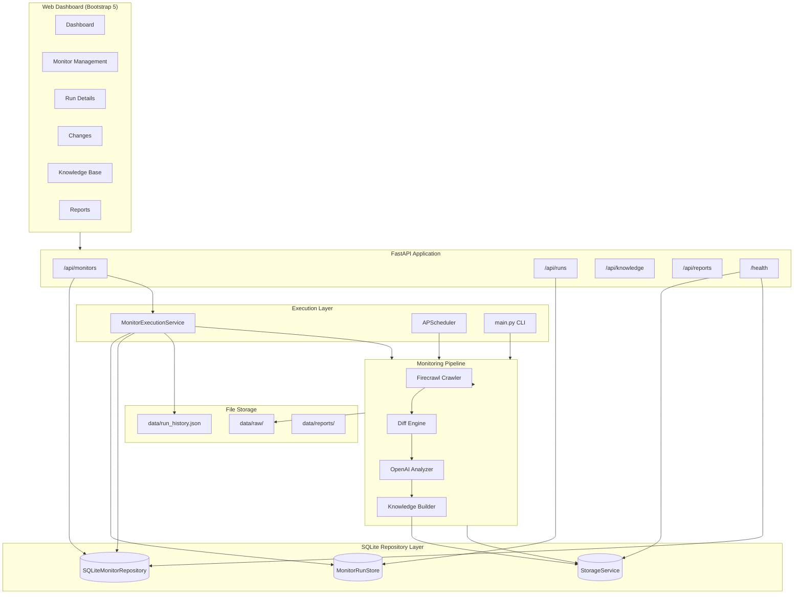
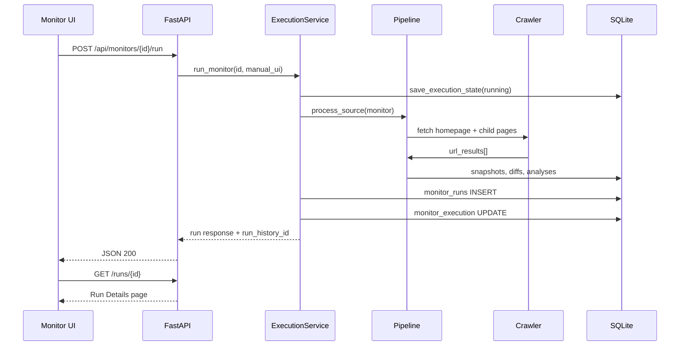
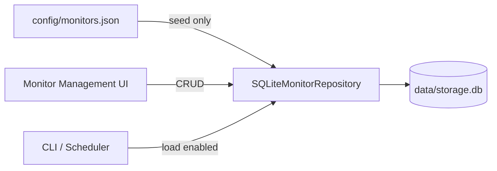

# System Architecture — v1.1.5 Stable

The **EU AI Regulation Monitor** is an internal platform that crawls official regulation sources, detects multi-page content changes, analyzes impact with AI, stores structured knowledge, and presents results through a FastAPI web dashboard.

---

## High-level diagram

---

## Core components

| Component | Location | Role |
|-----------|----------|------|
| Web dashboard | `app/web/` | Jinja2 UI, REST routes, monitor management |
| Monitor repository | `app/monitors/repository.py` | Canonical monitor CRUD in SQLite |
| Run store | `app/monitors/run_store.py` | Persistent run history and page results |
| Execution service | `app/monitors/execution.py` | Manual runs, lock, persistence orchestration |
| Pipeline | `app/pipeline.py` | Per-monitor crawl → diff → analyze flow |
| Crawler | `app/crawler/` | Firecrawl integration, link discovery |
| Storage | `app/storage/service.py` | Snapshots, diffs, analyses, knowledge |
| Scheduler | `app/scheduler.py` | Daily/weekly monitor and report jobs |
| CLI | `main.py` | `run-once`, `scheduler`, `status`, `generate-report` |

---

## Multi-page monitoring flow

Each URL in `url_results` carries its own status, snapshot IDs, and diff ID. Page-level results are serialized to `monitor_runs.page_results_json` for stable historical replay.

---

## Monitor data authority

Runtime monitor edits never write back to `config/monitors.json`.

---

## Status model (v1.1.5)

Two concepts are separated in the UI and run store:

| Concept | Values | Meaning |
|---------|--------|---------|
| **Execution status** | `success`, `failed`, `running` | Did the run complete without error? |
| **Change status** | `changed`, `unchanged`, `baseline`, `failed` | Were content changes detected? |

---

## Category management

Categories are stored as normalized strings on each monitor (`national_regulation`). The UI:

1. Loads suggestions from `GET /api/monitors/categories` (built-in + distinct stored values).
2. Normalizes user input on create/update via `normalize_category()`.
3. Displays labels via `format_category_label()` (with acronym support for EU, AI, DSA, etc.).

---

## Technology stack

| Layer | Technology |
|-------|------------|
| Language | Python 3.11 |
| Web framework | FastAPI + Uvicorn |
| Templates | Jinja2 |
| Frontend | Bootstrap 5.3 |
| Database | SQLite |
| Crawler | Firecrawl |
| AI | OpenAI Responses API |
| Scheduler | APScheduler |

---

## Related documents

- [API.md](API.md)
- [Database.md](Database.md)
- [Deployment.md](Deployment.md)
- [DeveloperGuide.md](DeveloperGuide.md)
