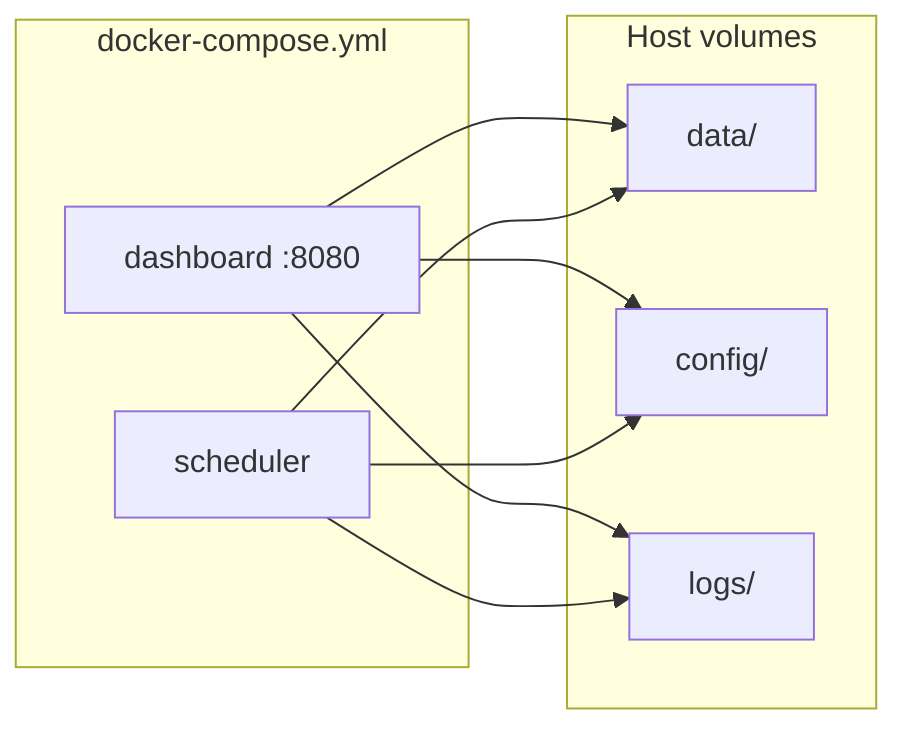

# Deployment Guide — v1.1.5 Stable

Docker-based deployment guide for the EU AI Regulation Monitor on internal networks.

---

## Prerequisites

- Docker 20+
- Docker Compose v2+
- API keys for OpenAI and Firecrawl

---

## Quick deploy

```bash
cp .env.example .env
# Edit .env — set OPENAI_API_KEY, FIRECRAWL_API_KEY

docker compose build
docker compose up -d
```

Dashboard: http://localhost:8080

---

## Services



| Service | Container | Command | Port |
|---------|-----------|---------|------|
| `dashboard` | `ai-regulation-dashboard` | `uvicorn app.web.app:app --host 0.0.0.0 --port 8080` | 8080 |
| `scheduler` | `ai-regulation-scheduler` | `python main.py scheduler` | — |

Both services share the same image built from the project `Dockerfile`.

---

## Environment variables

Copy `.env.example` to `.env`:

| Variable | Required | Description |
|----------|----------|-------------|
| `OPENAI_API_KEY` | Yes | OpenAI API key |
| `FIRECRAWL_API_KEY` | Yes | Firecrawl crawling API key |
| `SMTP_PASSWORD` | No | Email delivery for reports |
| `APP_ENV` | No | Set `development` for dev test site routes |
| `APP_TIMEZONE` | No | IANA timezone for scheduler cron jobs (default: `Europe/Berlin`) |

See [configuration.md](configuration.md) for full SMTP and email settings.

### Timezones

- **Scheduler:** cron jobs fire in `APP_TIMEZONE` (default `Europe/Berlin`), including automatic CET/CEST daylight-saving transitions.
- **Database:** all persisted timestamps are stored as UTC (`+00:00`).
- **Dashboard:** timestamps render in each user's browser local timezone.
- **Container logs:** optional `TZ=Europe/Berlin` is set in `docker-compose.yml` for readable log timestamps only.

---

## Persistent volumes

| Host path | Container path | Contents |
|-----------|----------------|----------|
| `./data` | `/app/data` | `storage.db`, snapshots, reports, run history |
| `./config` | `/app/config` | Seed monitors, notification, report config |
| `./logs` | `/app/logs` | Application logs |

**Important (v1.1.5):** Monitor runtime state lives in `data/storage.db`. Back up `data/` before upgrades.

---

## Health check

The dashboard service includes a Docker health check against `/health`:

```bash
curl http://localhost:8080/health
```

Example response:

```json
{
  "status": "ok",
  "timestamp": "2026-07-21T12:00:00",
  "database": "ok",
  "scheduler": "ok"
}
```

---

## Logging

| File | Level | Contents |
|------|-------|----------|
| `logs/app.log` | INFO+ | Pipeline runs, scheduler, monitor execution |
| `logs/error.log` | ERROR | Exceptions and failures |

```bash
docker compose logs -f dashboard
docker compose logs -f scheduler
tail -f logs/app.log
```

Startup logs include runtime paths and monitor repository state (`SQLiteMonitorRepository`, enabled count).

---

## Scheduler jobs

When the scheduler container is running:

| Job | Default schedule |
|-----|------------------|
| Daily monitors | 08:00 daily |
| Weekly monitors | Monday 08:00 |
| Weekly report | Monday 08:30 (configurable in `config/report.json`) |

Manual one-shot run inside container:

```bash
docker compose exec scheduler python main.py run-once
```

---

## Upgrade procedure (v1.1.5)

1. Back up `data/` directory.
2. Pull latest code or image.
3. Rebuild and restart:

```bash
docker compose down
docker compose build --no-cache
docker compose up -d
```

4. Verify health and monitor count on `/monitors`.
5. Run a test manual monitor run and open Run Details.

No manual SQL migration is required — schema updates apply on application startup.

---

## Troubleshooting

| Symptom | Likely cause | Action |
|---------|--------------|--------|
| Dashboard 503 on `/health` | DB not writable | Check `data/` permissions |
| Enabled monitors: 0 | Empty or wrong DB | Confirm volume mount; check startup logs |
| Manual run fails | Missing API keys | Verify `.env` in container |
| Scheduler not running | Container stopped | `docker compose ps`; restart scheduler |
| Stale monitor list | Browser cache | Hard refresh; confirm SQLite has rows |

Inspect SQLite inside container:

```bash
docker compose exec dashboard sqlite3 /app/data/storage.db "SELECT COUNT(*) FROM monitors;"
```

---

## Production recommendations

- Run behind a reverse proxy with TLS for non-localhost access.
- Restrict port 8080 to internal network/VPN.
- Schedule regular `data/` backups including `storage.db`.
- Monitor `logs/error.log` and `/health` with your ops tooling.
- Do not expose the development change-test routes in production (`APP_ENV` ≠ development).

---

## Related documents

- [Architecture.md](Architecture.md)
- [Database.md](Database.md)
- [DeveloperGuide.md](DeveloperGuide.md)
- [configuration.md](configuration.md)
