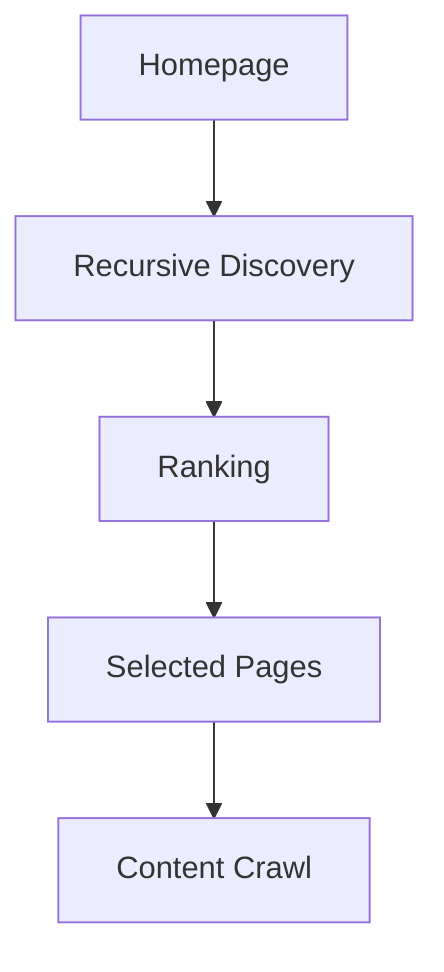

# User Guide

This guide covers day-to-day use of the AI Regulation Monitoring Platform for internal compliance and engineering teams.

## Getting Started

1. Configure environment variables (see `docs/configuration.md`).
2. Start the dashboard: `uvicorn app.web.app:app --host 0.0.0.0 --port 8080`
3. Open http://localhost:8080

For automated monitoring, also run the scheduler: `python main.py scheduler`

## Add a Monitor Source

Monitors define which regulation websites to track.

### Via the Dashboard

1. Go to **Manage Monitors** (`/manage-monitors`).
2. Click **Add Monitor** and fill in:
   - **Name** — display name (e.g. "EU AI Act")
   - **URL** — official source page
   - **Keywords** — terms used for relevance filtering
   - **Category** — grouping label (e.g. "AI Regulation")
   - **Frequency** — `daily` or `weekly`
   - **Enabled** — toggle to include in scheduled runs
3. Save the monitor. Changes are written to `config/monitors.json`.

### Smart Discovery

Smart Discovery starts at the monitor homepage, recursively discovers relevant child pages on the same site, ranks candidates, and crawls the top pages up to your **Max Pages** limit.



Process overview:

1. **Homepage** — discovery begins at the configured monitor URL.
2. **Recursive Discovery** — child links are fetched up to **Max Depth**, filtered by keywords, domain rules, and safety limits.
3. **Ranking** — candidate pages are scored using keywords, category terms, and URL/title signals.
4. **Selected Pages** — the highest-ranked pages are kept, including the homepage, up to **Max Pages**.
5. **Content Crawl** — each selected page is fetched and compared against prior snapshots.

Recommended Smart Discovery settings:

- **Max Depth:** `2`
- **Max Pages:** `10`

The homepage always counts toward **Max Pages**. When you choose Smart Discovery for a new monitor, the dashboard applies these defaults unless you have already changed depth or page limits manually.

Safety limits during discovery:

- Up to **200** candidate URLs per run
- Up to **100** crawlable links parsed per fetched page
- Tracking query parameters (for example `utm_*`, `fbclid`, `gclid`) are removed before deduplication

After each run, open **Run Details** to review the **Discovery Summary** (pages fetched, candidates, skips, and any discovery fetch errors).

### Via Configuration File

Edit `config/monitors.json` directly and restart the scheduler if it is running.

Example monitor entry:

```json
{
  "id": "eu_ai_act",
  "name": "EU AI Act",
  "url": "https://digital-strategy.ec.europa.eu/en/policies/regulatory-framework-ai",
  "keywords": ["AI Act", "smart TV"],
  "category": "AI Regulation",
  "frequency": "daily",
  "enabled": true
}
```

## Run Monitoring

### One-Time Run (All Enabled Monitors)

```bash
python main.py run-once
```

This crawls all enabled sources, compares snapshots, runs AI analysis on changes, and saves results.

### Scheduled Runs

```bash
python main.py scheduler
```

The scheduler runs (all times **Europe/Berlin** by default, configurable via `APP_TIMEZONE`):

- **Daily monitors** — every day at 08:00 Europe/Berlin
- **Weekly monitors** — every Monday at 08:00 Europe/Berlin
- **Weekly report** — every Monday at 08:30 Europe/Berlin (configurable in `config/report.json`)

### Time display

- Database timestamps are stored in **UTC** with an explicit offset (`+00:00`).
- The dashboard converts timestamps to your **browser's local timezone** automatically.
- Legacy naive timestamps from earlier releases are interpreted as UTC when displayed.

### Check Status

```bash
python main.py status
```

Shows configured monitors and the most recent pipeline run summary.

## Review Regulation Changes

1. Open **Changes** (`/changes`) from the navigation bar.
2. Browse detected diffs sorted by date.
3. Filter by impact level (HIGH, MEDIUM, LOW) or search by keyword.
4. Click a change to open the **Detail** page with:
   - Diff content (added/removed text)
   - AI impact analysis
   - Affected product modules
   - Recommended actions
   - Source URL and discovery tree

The **Dashboard** home page shows today's change count and risk breakdown.

## Search the Knowledge Base

The knowledge base stores structured regulation items extracted from analyses.

1. Go to **Knowledge Base** (`/knowledge`).
2. Search by title, keyword, category, or module filter.
3. Open an item to view:
   - Full regulation metadata
   - Related regulations
   - Similar items
   - Regulation timeline
4. Visit **Knowledge Statistics** (`/knowledge/statistics`) for aggregate counts by category and module.

**Insights** (`/insights`) provides a compliance-focused view grouped by impact and affected modules.

## Generate Reports

### Manual Generation

```bash
python main.py generate-report
```

Or from the dashboard:

1. Go to **Reports** (`/reports`).
2. Click **Generate Report** to create a weekly report for the current period.
3. Review the executive summary, key changes, and risk overview.

Reports are saved as JSON in `data/reports/`.

### Scheduled Reports

When the scheduler is running, weekly reports are generated automatically per `config/report.json`. Email delivery is optional and requires `SMTP_PASSWORD` and recipient configuration.

### Demo Data

Sample files in `data/demo/` illustrate snapshot, analysis, and report JSON formats for training and demos. These files are not loaded by the application.

## Tips

- Use **Monitors** (`/monitors`) to see all configured sources and their settings.
- Check **About** (`/about`) for version info and configuration status.
- Use `GET /health` or `docker compose ps` to verify system health in deployed environments.
- Review `logs/app.log` for pipeline and scheduler activity.

## Further Reading

- [Architecture](architecture.md)
- [Configuration](configuration.md)
- [Deployment](deployment.md)
